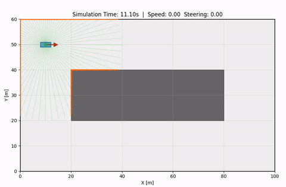

# tiny-lidar-net-example

A minimal example of self-driving via 2D LiDAR simulation and supervised learning.
Educational code that walks through how **TinyLidarNet** (1D CNN) works.


Reference: Zarrar et al., [*TinyLidarNet: 2D LiDAR-based End-to-End Deep Learning Model for F1TENTH Autonomous Racing*](https://arxiv.org/abs/2410.07447) (arXiv:2410.07447, 2024).

The simulation environment uses [robosim2d](https://github.com/araitaiga/robosim2d),
and you can experience the full flow of keyboard-driven data collection → CNN training → autonomous driving.

## Structure

```
tiny-lidar-net-example/
├── main.py                  # CLI entry point
├── commands/
│   ├── collect.py           # Collect training data via manual driving
│   ├── train.py             # Train the CNN model
│   ├── autodrive.py         # Run autonomous driving with a trained model
│   └── evaluate.py          # Headless runs across multiple worlds × start positions, aggregating driving metrics
├── tiny_lidar_net/          # TinyLidarNet package
│   ├── control.py           # Control (NamedTuple)
│   ├── model.py             # TinyLidarNet (1D CNN)
│   ├── dataset.py           # LidarDataset (NPZ loader)
│   └── trainer.py           # Training loop
├── worlds/                  # World definitions (each holds robot.yaml + world.yaml + eval.yaml)
│   ├── circuit/             # 100×60 circuit course
│   ├── curved_circuit/      # 120×80 curved circuit
│   ├── chicane_circuit/     # 120×80 circuit with a chicane
│   ├── diagonal_chicane_circuit/
│   ├── double_island_circuit/
│   └── maze/
├── outputs/                 # Output directory (models, training data, plots)
└── pyproject.toml
```

### Role of each component

| Component | Description |
|---|---|
| **robosim2d** | 2D simulation environment. Handles vehicle physics (Ackermann/DiffDrive models), LiDAR sensor (1081 rays), collision detection, and rendering. [robosim2d](https://github.com/araitaiga/robosim2d) |
| **commands/** | CLI subcommands. Create and operate the robosim2d environment |
| **tiny_lidar_net/** | PyTorch-based CNN (TinyLidarNet) and training pipeline. Independent of the simulator |
| **worlds/** | World definition directory (each world stores robot.yaml + world.yaml) |

## Setup

Requires Python 3.11 or later. The package manager [uv](https://docs.astral.sh/uv/) is recommended.  

```bash
# Using uv (recommended)
uv sync                 # builds .venv from uv.lock; the project is installed editable

# Include dev dependencies (pytest)
uv sync --extra dev
```

With uv, run commands via `uv run`.  
If you prefer pip, create and activate a virtual environment yourself, then install:

```bash
# Using pip
pip install -e .
```

All dependencies (numpy / robosim2d / matplotlib / torch) are installed as main dependencies.

## Usage

Build a self-driving model in three steps, and use the evaluate command for quantitative comparison when needed.

The examples below use `uv run`. With a pip-based setup, activate the virtual environment and drop the `uv run` prefix (`python main.py ...`).

### 1. Collect training data (`collect`)

Drive the vehicle manually with the keyboard, recording pairs of LiDAR scans and control inputs.

```bash
uv run python main.py collect -w worlds/circuit -o outputs/training_data.npz
```

A simulator window opens, showing the vehicle and LiDAR.



**Controls:**

| Key | Action |
|---|---|
| `W` / `↑` | Accelerate |
| `S` / `↓` | Decelerate |
| `A` / `←` | Steer left |
| `D` / `→` | Steer right |
| `Space` | Brake (speed 0) |
| `Q` / `Esc` | Quit and save |

On exit, an `.npz` file is saved (`lidar: (N, 1081)`, `control: (N, 2)`).
Frames where `speed=0` and `steering=0` are not recorded (to prevent label distribution bias).

### 2. Train the model (`train`)

Train TinyLidarNet on the collected data.

```bash
uv run python main.py train -d outputs/training_data.npz -o outputs/tiny_lidar_net.pth -e 100
```

Multiple data files can be combined for training:

```bash
uv run python main.py train -d outputs/data1.npz outputs/data2.npz -o outputs/tiny_lidar_net.pth
```

**Main options:**

| Option | Default | Description |
|---|---|---|
| `-d` | (required) | Training data files (multiple allowed) |
| `-o` | `outputs/tiny_lidar_net.pth` | Model output path |
| `-e` | 100 | Number of epochs |
| `-b` | 32 | Batch size |
| `--lr` | 0.001 | Learning rate |

After training, the model (`.pth`) and loss curve (`.png`) are written out.

### 3. Autonomous driving (`autodrive`)

Use the trained model to control the vehicle automatically.

```bash
uv run python main.py autodrive -w worlds/circuit -m outputs/tiny_lidar_net.pth
```

The LiDAR scan is fed to the model, and the vehicle is driven with the predicted steering and speed.
The run ends on collision or when the window is closed.


### 4. Evaluation (`evaluate`)

A helper script that runs a trained model headlessly across the `worlds/` directories and aggregates driving metrics (success rate, distance, speed, etc.).

```bash
uv run python main.py evaluate -m outputs/tiny_lidar_net.pth
```

See `uv run python main.py evaluate --help` for the available options.

## World definitions

Worlds are defined as subdirectories under the `worlds/` directory.
Each subdirectory contains `robot.yaml` (robot configuration) and `world.yaml` (world configuration).

**robot.yaml:**

```yaml
kinematics: {name: 'acker'}                                      # Ackermann (bicycle) model
shape: {name: 'rectangle', length: 4.0, width: 1.8, wheelbase: 2.5}
state: [5.0, 5.0, 0.0, 0.0]                                     # [x, y, yaw, steering]
vel_max: [10.0, 0.7854]                                          # [max speed, max steering angle]
sensors:
  - type: 'lidar2d'
    number: 1081           # Number of rays
    range_max: 30.0        # Max detection range [m]
    angle_range: 6.28318   # 360 degrees
```

**world.yaml:**

```yaml
world:
  height: 50.0
  width: 50.0

obstacle:
  - shape: {name: 'rectangle', length: 4.0, width: 4.0}
    state: [15.0, 15.0, 0]    # [x, y, angle]
```

## TinyLidarNet architecture

A 1D CNN that outputs steering angle and speed from a LiDAR scan (1081 dimensions).

```
Input: (batch, 1, 1081)
  ↓ Conv1d(1→24,  k=10, s=4)   → 268
  ↓ Conv1d(24→36, k=8,  s=4)   → 66
  ↓ Conv1d(36→48, k=4,  s=2)   → 32
  ↓ Conv1d(48→64, k=3,  s=1)   → 30
  ↓ Conv1d(64→64, k=3,  s=1)   → 28
  ↓ Flatten                     → 1792
  ↓ FC(1792→100) + ReLU + Dropout
  ↓ FC(100→50)   + ReLU + Dropout
  ↓ FC(50→10)    + ReLU
  ↓ FC(10→2)
Output: (batch, 2) = [steering_angle, speed]
```

# Notes

Official implementation

<https://github.com/CSL-KU/TinyLidarNet/blob/main/train.py>

Activation in hidden layers: ReLU
Activation in final output layer: tanh
Dropout: none
Optimizer: Adam(5e-5)
Loss function: huber
batch_size: 64, epoch: 20
