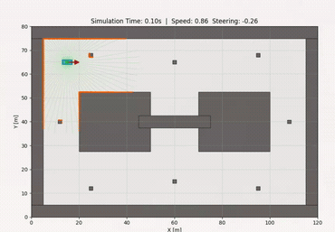
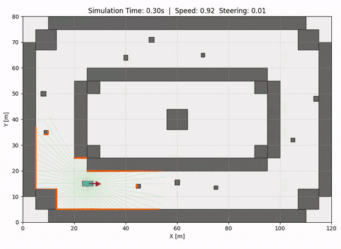
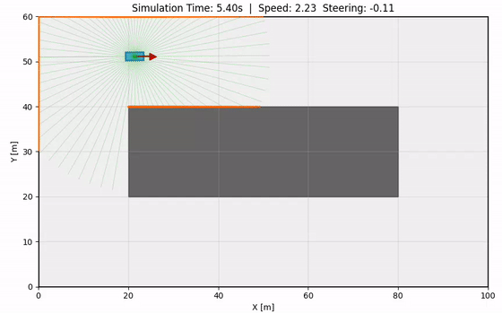
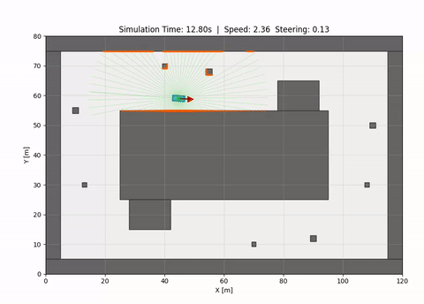
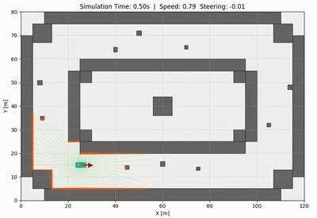
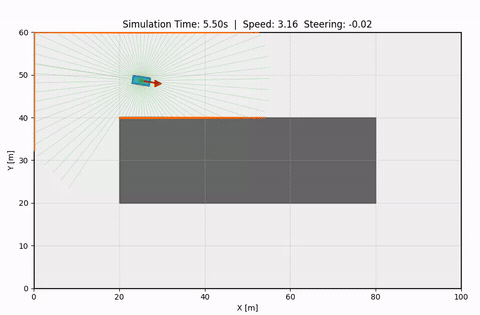
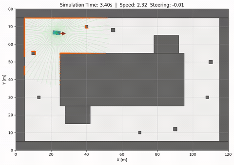
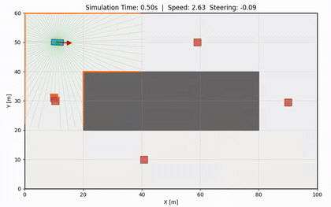
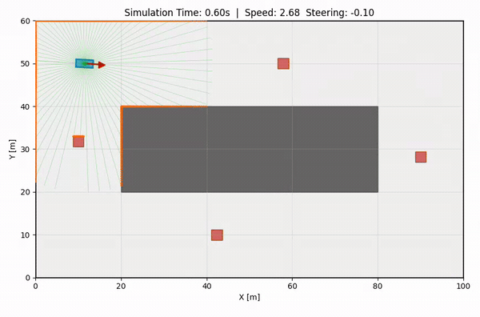

## はじめに

本記事では、2D LiDAR を入力、ステアリング角と速度を出力とする自動運転 End-to-End モデルである、TinyLidarNet [1] を取り上げます。TinyLidarNet は自律走行レース競技で 3 位入賞した軽量モデルで、 MCU 上でもリアルタイム推論が可能とされています。
記事前半では論文の内容を整理し、後半では PyTorch と 2D シミュレータを用いた小規模構成の実装を用いて具体的な実装や動作を解説します。


<https://github.com/araitaiga/tiny_lidar_net_example>

## 1. TinyLidarNet

### 1.1 概要

TinyLidarNet は End-to-End モデルの自動運転アーキテクチャです。End-to-End モデルとは、センサ入力から制御出力までを単一のニューラルネットワークで写像する手法で、多くの場合、教師データ（模倣先）として人間の運転操作が使用されます。  


こうした End-to-End モデルのネットワークとして有名なものには、ALVINN [2] や NVIDIA の PilotNet [3] などがあります。
これらのモデルの多くは、カメラ画像から操舵を推論するものです。一方、本記事で扱う TinyLidarNet は 2D LiDAR を入力とします。

LiDAR がカメラと比較して優れている点は、入力データ量が少ないこと、照明条件に影響を受けにくいことなどです。TinyLidarNet 以前にも LiDAR を入力とする End-to-End モデルは存在しましたが、その多くが MLP (全結合層の積層) ベースであり、論文ではそれらの性能に課題があったと主張されています。

そこで TinyLidarNet では、1D の畳み込み層 (1D Conv) を含むモデルが提案されています。入力の 2D LiDAR を 1D Conv で処理することで、データに含まれる空間構造を抽出しやすくなり、走破性や未訓練コースに対する汎化性能が向上したと述べられています。  


(小規模構成実装の TinyLidarNet の動作)  



### 1.2 アーキテクチャ

TinyLidarNet のネットワーク構造は以下です。 (k: カーネルサイズ, s: ストライド)  


入力は 2D LiDAR の距離配列で、サイズは L モデルで 1081 点です。その他、論文では間引きを入れた M モデル (541 点)、S モデル (271 点)の性能評価も行われていますが、本記事では L モデルに限定して解説します。  
まず、入力を 5 層の 1D 畳み込み層で処理し、28 × 64 チャンネルにします。次に 4 層の全結合層で情報を集約し、出力としてステアリング角と速度を回帰します。  
総パラメータ数は約 22 万と小規模です。そのため学習データも小規模で済み、論文では手動運転およそ 5 分 (約 1.2 万サンプル) の学習データで訓練して十分な性能が得られたと報告されています。

### 1.3 論文で報告されている評価

#### 大会実績

第 12 回 F1TENTH Autonomous Grand Prix において、13 チーム中 3 位を獲得しました。

#### 未訓練コースでの汎化

- シミュレーション 4 トラックにおいて、TinyLidarNet は完走率 100% を達成
- 比較対象の MLP256（全結合層アーキテクチャの過去手法）はほとんどのケースで完走できなかった
- 実機の未訓練トラックでも、TinyLidarNet のみが完走

#### 計算コスト

INT8 量子化という計算コスト軽量化を行った場合の、推論時のレイテンシが測定されています。

| プラットフォーム | TinyLidarNet L | TinyLidarNet M | TinyLidarNet S |
|---|---|---|---|
| Jetson Xavier NX | <1 ms | <1 ms | <1 ms |
| ESP32-S3 (Xtensa LX7) | 16 ms | 8 ms | 4 ms |
| Raspberry Pi Pico (Cortex-M0+) | 196 ms | 91 ms | 36 ms |

40 Hz (周期 25 ms) の制御を想定すると、ESP32-S3 では L モデルでも余裕があり、Raspberry Pi Pico でも S モデルに限れば 20 Hz 程度の制御に間に合う水準とされています。

#### 動的環境への対応  

静的障害物環境でのみで学習したモデルが、動的な他車両を追い越すような挙動を示したと報告されています。これは移動する車両をネットワークが壁や静止物として扱った結果ではないかと推測されています。

## 2. TinyLidarNet の実装

それでは、TinyLidarNet の具体的な実装を見ていきます。  
公式実装 [4] は TensorFlow/Keras + ROS の構成になっているため、動作させるまでの環境構築のコストが大きめです。本記事では、論文の提案ネットワークアーキテクチャにほぼ準拠しつつ、PyTorch + 自作の軽量 2D シミュレータ (robosim2d) で小規模に再実装しました。コード量を抑えて、本質的なモデル定義や学習方法を追いやすい実装を意識しています。

:::message
細かい仕様に差異があるので、完全に論文に忠実な実装を知りたい方は公式実装 [4] を参照してください。
:::

なお、2D シミュレータについては、当初 IR-SIM (<https://github.com/hanruihua/ir-sim>) や F1TENTH Gym (<https://github.com/f1tenth/f1tenth_gym>) の利用を検討しました。しかし、手元の環境では 1081 点規模の 2D LiDAR をシミュレートする際の計算コストが大きかったため、本記事では軽量化を目的に自作した robosim2d を使用しています。  

- TinyLidarNet 小規模実装: <https://github.com/araitaiga/tiny_lidar_net_example>

- 2D シミュレータ: <https://github.com/araitaiga/robosim2d>

### 2.1 リポジトリ構成

```
tiny_lidar_net_example/
├── main.py                  # CLI エントリ (collect / train / autodrive / evaluate)
├── tiny_lidar_net/
│   ├── model.py             # 1D CNN 本体
│   ├── control.py           # ステア・速度の正規化と並び順を集約
│   ├── dataset.py           # npz ファイルを PyTorch Dataset 化
│   └── trainer.py           # 学習ループ
├── commands/                # サブコマンド (collect / train / autodrive / evaluate)
├── worlds/                  # robosim2d 用コース定義 (YAML)
└── outputs/                 # 出力先 (モデル .pth / 学習データ .npz / プロット .png)
```

学習データ収集 (`collect`)、学習 (`train`)、自動走行 (`autodrive`)、複数ワールドでの評価 (`evaluate`) の 4 つを `main.py` のサブコマンドとしています。


### 2.2 モデル定義 (`tiny_lidar_net/model.py`)

TinyLidarNet のニューラルネットワークアーキテクチャを表現する、中心的なクラスです。  

`tiny_lidar_net/model.py`  

```python
class TinyLidarNet(nn.Module):
    def __init__(self):
        super().__init__()
        self.input_length = 1081  # 入力長は 1081 に固定 (Lモデル)

        self.conv1 = nn.Conv1d(1, 24, kernel_size=10, stride=4)
        self.conv2 = nn.Conv1d(24, 36, kernel_size=8, stride=4)
        self.conv3 = nn.Conv1d(36, 48, kernel_size=4, stride=2)
        self.conv4 = nn.Conv1d(48, 64, kernel_size=3, stride=1)
        self.conv5 = nn.Conv1d(64, 64, kernel_size=3, stride=1)

        self.flatten = nn.Flatten()
        # 入力長 1081 のとき Conv5 通過後の時間軸長は 28
        flat_len = 64 * 28  # = 1792
        self.fc1 = nn.Linear(flat_len, 100)
        self.fc2 = nn.Linear(100, 50)
        self.fc3 = nn.Linear(50, 10)
        self.fc4 = nn.Linear(10, 2)

        self.relu = nn.ReLU()

    def forward(self, x: torch.Tensor) -> torch.Tensor:
        x = self.relu(self.conv1(x))
        x = self.relu(self.conv2(x))
        x = self.relu(self.conv3(x))
        x = self.relu(self.conv4(x))
        x = self.relu(self.conv5(x))
        x = self.flatten(x)
        x = self.relu(self.fc1(x))
        x = self.relu(self.fc2(x))
        x = self.relu(self.fc3(x))
        x = torch.tanh(self.fc4(x))
        return x
```

forward() 内でアーキテクチャが組み立てられています。畳み込み層 + ReLU による変換を 5 層、全結合層 + ReLU による変換を 4 層重ねた、シンプルなモデルです。  

なお、最終層には `tanh` が入っています。 tanh は入力を [-1, 1] の範囲に揃えて出力する、S 字型の活性化関数です。


ロボットが取りうるステアリングと速度はいずれも有界な物理量 [最小制御値, 最大制御値] のため、ニューラルネットワークの出力範囲を tanh で制限した上で、ロボットには -1 --> 最小制御値、 1 --> 最大制御値 と変換した値を与えることで、モデルの出力が制限を超えないようにしています。学習時の損失計算の際には、教師データ側も同じレンジ [-1, 1] に正規化しておく必要があります。


### 2.3 学習ループ (`tiny_lidar_net/dataset.py`, `tiny_lidar_net/trainer.py`)

学習は、収集した教師データ (LiDAR スキャンと制御値のペア) を入力として、モデルの出力が教師の制御値に近づくよう重みを更新する、標準的な教師あり学習 (Behavior Cloning) です。データの受け渡しを担う `LidarDataset` と、学習ループを担う `Trainer` の 2 つに分けて実装しています。  

まず `LidarDataset` では、教師データファイルから読み込んだ配列を torch.Tensor に変換します。  

`tiny_lidar_net/dataset.py`  

```python
class LidarDataset(Dataset):
    def __init__(self, lidar_data, control_data):
        self.lidar = torch.from_numpy(lidar_data).float()
        # 制御ラベルを tanh の出力域 [-1, 1] に正規化して保持する
        self.control = torch.from_numpy(normalize_labels(control_data)).float()

    def __getitem__(self, idx):
        # 先頭にチャンネル次元を足し (1081,) -> (1, 1081) として Conv1d に渡す
        return self.lidar[idx].unsqueeze(0), self.control[idx]
```

- 教師データの制御ラベルは下記 2.5 の `normalize_labels` で `[-1, 1]` に正規化しています。これは前述のモデル最終層 `tanh` の出力域と揃えるためです
- `__getitem__` で `unsqueeze(0)` により先頭にチャンネル次元を足し、`(1081,)` を `(1, 1081)` にしています。`Conv1d` は `(チャンネル, 長さ)` の入力を前提とするためで、LiDAR スキャンは 1 チャンネルとして扱います

次に `Trainer` では、損失関数と最適化手法を論文に合わせて設定し、エポックごとに train / val の 2 つのフェーズを繰り返します。

`tiny_lidar_net/trainer.py`  

```python
class Trainer:
    def __init__(self, model, learning_rate=5e-5, device=None):
        self.model = model
        self.criterion = nn.HuberLoss(delta=1.0)                       # 損失: Huber loss
        self.optimizer = torch.optim.Adam(model.parameters(), lr=learning_rate)  # 最適化: Adam

    def train(self, dataset, epochs=20, batch_size=64, val_split=0.2):
        # データを train / val に分割し、それぞれの DataLoader を作る
        train_loader, val_loader = ...  # random_split + DataLoader

        best_val_loss = float("inf")
        for epoch in range(epochs):
            train_loss = self._train_one_epoch(train_loader)  # 学習 (重み更新あり)
            val_loss = self._validate(val_loader)             # 検証 (重み更新なし)
            # val loss が最小のときの重みを最良モデルとして保持する
            if val_loss < best_val_loss:
                best_val_loss = val_loss
                best_state = {k: v.clone() for k, v in self.model.state_dict().items()}
        self.model.load_state_dict(best_state)  # 学習終了後、最良の重みへ戻す

    def _train_one_epoch(self, loader):
        self.model.train()                    # 学習モード (dropout 等を有効化)
        for lidar, control in loader:
            self.optimizer.zero_grad()        # 勾配をリセット
            output = self.model(lidar)        # 順伝播でTinyLidarNetモデル出力を得る
            loss = self.criterion(output, control)  # 教師の制御値との誤差
            loss.backward()                   # 逆伝播で勾配を計算
            self.optimizer.step()             # 重みを更新

    def _validate(self, loader):
        self.model.eval()                     # 評価モード (dropout 等を無効化)
        with torch.no_grad():                 # 勾配計算を止め、検証損失のみ算出
            for lidar, control in loader:
                output = self.model(lidar)
                loss = self.criterion(output, control)
```

学習の構成は次のとおりです。

- 損失関数は `nn.HuberLoss(delta=1.0)`、最適化は `Adam(lr=5e-5)`、`batch_size=64` で、いずれも公式実装と同一の設定です
- `train()` がエポックのループを回し、各エポックで `_train_one_epoch()`（重み更新あり）と `_validate()`（重み更新なし）を順に呼びます
- `_train_one_epoch()` は PyTorch の標準的な学習 1 ステップです
- `_validate()` では重みを更新せず検証損失だけを測ります
- val loss が最小となったエポックの重みを保持しておき、学習終了後にその重みへ戻して最終モデルとしています (公式実装には無い仕様です)

ここで、HuberLoss は外れ値に強い損失関数です。誤差を e、しきい値を δ とすると、

```
|e| <= δ: 0.5 * e²（二乗誤差と同じ形）
|e| >  δ: δ * (|e| - 0.5δ)（線形）
```

と表せ、|e| = δ の点で値と勾配が連続になるように設計されています。誤差が大きい領域では線形になり、最適化計算の際に勾配が大きくなりすぎて学習が乱れることを防いでいます。  


### 2.4 推論と自動走行 (`commands/autodrive.py`)

`commands/autodrive.py`

```python
# モデルとシミュレーターの準備
model = TinyLidarNet.load(model_file)
sim = robosim2d.make(
    robot_file=world_dir / "robot.yaml",
    world_file=world_dir / "world.yaml",
    dt=DT,
    collision_mode="stop",
)
sim.reset()

# 推論ループ
for step in range(MAX_STEPS):
    scan = sim.get_lidar_scan()              # 1. LiDAR スキャンを取得
    control = model.predict(scan)            # 2. モデルで制御量を推論
    _, collision, _ = sim.step(control.to_robot_action())  # 3. 環境に適用して 1 ステップ進める
    if collision:
        break
```

学習済みモデルによる自動走行は、次の 3 ステップを毎ステップ繰り返すループとして実装しています。  

1. `sim.get_lidar_scan()` で現在の LiDAR スキャン (1081 点) を取得する  
2. `model.predict(scan)` で学習済み TinyLidarNet を使ってステアリングと速度を推論し、`Control` として受け取る
3. 下記 2.5 の `control.to_robot_action()` でシミュレータが要求する action 並び (`[speed, steering]`) に変換し、`sim.step()` で 1 ステップ進める


### 2.5 補足: 出力値の正規化 (`tiny_lidar_net/control.py`)

ステアリングと速度の値は、コードの各所で表現が異なります。これらの変換規約を 1 か所に集約しておくために、Control というクラスを作成しています。  

`tiny_lidar_net/control.py`  

規約の 1 つ目は、物理値と `tanh` の出力域 `[-1, 1]` の間の正規化です。各成分を最大値で割る（戻すときは掛ける）だけの単純な変換です。

```python
MAX_STEERING = 0.5  # [rad]
MAX_SPEED = 5.0     # [m/s]

def normalize_labels(labels):
    # 物理値 [steering, speed] -> tanh の出力域 [-1, 1] (各成分を最大値で割る)
    out = labels.astype(np.float32).copy()
    out[..., 0] /= MAX_STEERING
    out[..., 1] /= MAX_SPEED
    return out

def denormalize_labels(labels):
    # denormalize_labels は逆変換 (各成分に最大値を掛ける)
    ...
```

学習時はラベルを `normalize_labels` で `[-1, 1]` に揃え（前述の `LidarDataset`）、推論時はモデルの `tanh` 出力を `denormalize_labels` で物理値へ戻します。(なお、公式実装では、推論時のSteeringは逆正規化せずそのまま-1~1の値を使用しています。)

規約の 2 つ目は、本実装とシミュレータ間のAction並び順の違いの吸収です。ステアリングと速度の順番を合わせていますが、本質的ではないので省略します。詳しくはコードを参照してください。  


## 3. デモ・実験

次に、2 章の実装で TinyLidarNet の性能を確認していきます。単一ワールド・単一方向の学習データでのモデルと、多様性を増やした学習データでのモデルの挙動の変化を観察します。


### 3.1 単一ワールド・単一方向の学習データの場合

まず、一つのサーキット状のワールドを一定方向に走行した学習データのみで学習させた場合の挙動を確認します。

- 学習データ
  - ワールド: `worlds/curved_circuit`
  - 進行方向: 反時計回り (CCW) のみ
  - サンプル数: 約 6,200 samples
- モデル: `outputs/network/net_curved_circuit_only_ccw.pth`

#### 推論結果

学習時と同じワールド・同じ初期位置/方位で自動走行を開始したところ、半周程度であれば走行を継続できる挙動が確認できました。  




一方、学習データの開始位置とは異なる初期位置から自動走行を開始したり、未学習のシンプルなワールドで走行させると、走行が継続できなくなりました。  

 　


また、大局的には道が進行方向右側にカーブしているような状況でも、細かい障害物の周囲を局所的に反時計回りに回ろうとする挙動が見られました。  
TinyLidarNet は自己方位に対する周囲形状の情報を元に、自己方位前方側のフリーな領域へ進むような制御指令値を学習していると考えられます。そのため、本来は初期方位を変えるだけで、ロボットがサーキットコースを時計回りに走行するか、反時計回りに走行するかが自然に切り替わります。  
しかし、今回の学習データは反時計回りでのみ収集されているので、制御指令値に反時計回りのバイアスがかかっており、このような逆走が発生したと思われます。  




以下では、複数のワールド (学習時のワールドを含む) と複数の初期状態 (位置、方位) で、壁に衝突するかスタックするまでの平均走行距離と速度を測定しています。  
10000 ステップの間 衝突 or スタックせずに走行を継続した場合、Success とみなしています。  


| World | Success% | Stuck% | Coll% | MeanDist | MeanAvgV |
| --- | ---: | ---: | ---: | ---: | ---: |
| curved_circuit (学習ワールド) | 0% | 0% | 100% | 55.3 | 2.30 |
| chicane_circuit | 0% | 0% | 100% | 28.3 | 1.31 |
| circuit | 0% | 0% | 100% | 27.8 | 1.42 |
| diagonal_chicane_circuit | 0% | 0% | 100% | 31.4 | 1.41 |
| double_island_circuit | 0% | 0% | 100% | 46.2 | 1.57 |
| maze | 0% | 0% | 100% | 36.8 | 1.15 |

- 全ワールド、特に学習対象の `curved_circuit` でも全試行が衝突しており、初期状態を変えるだけで走行が破綻しやすい様子が確認できました
- 学習データが「特定の形状を、特定の向きで走る」という 1 通りのパターンに偏っているため、モデルが初期位置や曲率の符号を過学習している可能性が考えられます


### 3.2 複数ワールド・両方向で学習した場合

続いて、学習データに別ワールドと逆方向の走行を加え、走行パターンの多様性を増やした場合の挙動を確認します。

- 学習データ
  - ワールド: `worlds/curved_circuit`、`worlds/chicane_circuit`
  - 進行方向: 時計回り (CW) と反時計回り (CCW) の両方
  - サンプル数: 約 24,800 samples
- モデル: `outputs/network/net_chicane_curved.pth`

#### 推論結果

先程同様、学習時と同じワールド・同じ初期位置・同じ進行方向で走行させたところ、走行継続距離が伸びました。  



また、未学習の以下のようなワールドで走行した場合も、走行し続けるケースが現れました。  

  
  
  


複数のワールドと初期状態での評価結果が以下です。  

| World | Success% | Stuck% | Coll% | MeanDist | MeanAvgV |
| --- | ---: | ---: | ---: | ---: | ---: |
| curved_circuit (学習ワールド) | 0% | 25% | 75% | 100.1 | 1.81 |
| chicane_circuit (学習ワールド) | 0% | 25% | 75% | 110.7 | 1.34 |
| circuit | 50% | 50% | 0% | 1745.6 | 2.56 |
| diagonal_chicane_circuit | 0% | 50% | 50% | 97.2 | 1.32 |
| double_island_circuit | 0% | 50% | 50% | 462.9 | 1.74 |
| maze | 0% | 25% | 75% | 65.1 | 1.68 |

- 全てのワールドで、衝突率が 100% から下がり、一方で `stuck` により停止する試行が現れました
- 未学習/シンプルなワールドの `circuit` では、4 試行中 2 試行で走行を完遂し、平均走行距離も 1,745 m と他ワールドを大きく上回りました
- 未学習/複雑なワールドの `diagonal_chicane_circuit` や `double_island_circuit` でも衝突率が下がり、走行距離が伸びる傾向が見られました  


#### 2 モデル比較 まとめ

2 モデルの平均走行継続距離 (MeanDist) と平均速度 (MeanAvgV) の比較は以下です。学習データの多様性を増やすと、モデルの汎化性能が向上し、走行継続距離が全てのケースで伸びる様子が確認できました。  

| World | only_ccw: MeanDist / MeanAvgV | chicane+curved (CW+CCW): MeanDist / MeanAvgV |
| --- | --- | --- |
| curved_circuit | 55.3 m / 2.30 m/s | 100.1 m / 1.81 m/s |
| chicane_circuit | 28.3 m / 1.31 m/s | 110.7 m / 1.34 m/s |
| circuit | 27.8 m / 1.42 m/s | 1745.6 m / 2.56 m/s |
| diagonal_chicane_circuit | 31.4 m / 1.41 m/s | 97.2 m / 1.32 m/s |
| double_island_circuit | 46.2 m / 1.57 m/s | 462.9 m / 1.74 m/s |
| maze | 36.8 m / 1.15 m/s | 65.1 m / 1.68 m/s |

### 3.3 動的環境での動作

論文で主張されている、動的環境への対応能力を確認します。障害物の位置が動的に変化する World を用意し、3.2 の学習済みモデルで自動走行を行いました。  

#### 推論結果

モデルは、環境の初期状態を調整すると、ある程度動的な障害物を回避しつつ走行を継続することができました。  


しかし、障害物の速度や位置を少し変化させるだけでスタックしたり衝突するようになり、挙動としては不安定でした。多様な動的環境において走行を継続させるには、学習データを集める環境をもっと増やしたり、根本的に TinyLidarNet アーキテクチャ自体を見直す必要があるかもしれません。  



### 3.4 補足: 学習曲線

下図は約 10 分ほどの教師データを用いて、2 章の TinyLidarNet 実装を 100 epoch 学習させた際の Huber loss の推移です。


train / val loss はいずれも数 epoch で大きく低下し、その後収束しています。論文での epoch 数は 20 でしたが、それよりも長く回しても val loss がゆるやかに下がり続ける様子が観察されました。  
また、Train Loss と Val Loss の乖離も起きておらず、比較的良好に学習が進んでいるように見えます。ただし、上記の 3.1 で確認した通り、損失そのものが収束していても、学習データ自体に偏りがあると、必ずしも新環境での汎化性能が得られるわけではないことに注意が必要です。  

## 4. まとめ

今回の TinyLidarNet 実装で得られた結果のまとめです。  

- 約 220K パラメータと数分〜十数分程度の手動運転データでも、学習データと一致する静的環境下では 2D シミュレータ上での走行が成立しました
- 単一ワールド・単一方向の学習データでは、学習対象のワールドであっても初期位置を変えるだけで走行が破綻し、TinyLidarNet が学習データの分布に対して敏感である様子が確認できました
  - 一方、学習データに逆方向の走行や別ワールドの走行を加えると、未学習ワールドでも走行が継続する試行が現れ、データ多様性が汎化に寄与する傾向が見られました
- 動的環境でも走行を継続するケースは見られましたが、障害物の速度や位置がわずかに変化するだけでスタックや衝突に至るなど、挙動は不安定でした


---

## 参考文献

[1] Mohammed Misbah Zarrar, Qitao Weng, Bakhbyergyen Yerjan, Ahmet Soyyigit, Heechul Yun. "TinyLidarNet: 2D LiDAR-based End-to-End Deep Learning Model for F1TENTH Autonomous Racing." arXiv:2410.07447, 2024. <https://arxiv.org/abs/2410.07447>

[2] Dean A. Pomerleau. "ALVINN: An Autonomous Land Vehicle in a Neural Network." Advances in Neural Information Processing Systems 1 (NIPS 1988), pp. 305-313, 1989. <https://proceedings.neurips.cc/paper/1988/hash/812b4ba287f5ee0bc9d43bbf5bbe87fb-Abstract.html>

[3] Mariusz Bojarski, Davide Del Testa, Daniel Dworakowski, Bernhard Firner, Beat Flepp, Prasoon Goyal, Lawrence D. Jackel, Mathew Monfort, Urs Muller, Jiakai Zhang, Xin Zhang, Jake Zhao, Karol Zieba. "End to End Learning for Self-Driving Cars." arXiv:1604.07316, 2016. <https://arxiv.org/abs/1604.07316>

[4] 公式実装: <https://github.com/CSL-KU/TinyLidarNet>
